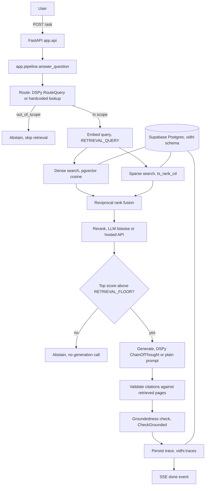

# Bharat's GST Smart Guide, RAG assistant

## 1. What this system does

This is a retrieval augmented generation question answering system over a single
1500 page GST reference manual, Bharat's GST Smart Guide, 3rd edition. Every answer
is grounded in retrieved excerpts from the manual and cites page numbers, rather than
relying on the model's own knowledge. Each question is answered independently, there
is no conversation memory or chat history.

## 2. Architecture



## 3. Quick start

### Local

```bash
docker build --build-arg GIT_SHA=$(git rev-parse --short HEAD) -t rag-local .
docker run --env-file .env -p 8080:8080 -e PORT=8080 rag-local
```

Then open `http://localhost:8080`.

### Deployed

TBD (filled in after the first successful deploy, see section 13.5 of CLAUDE.md).

## 4. Configuration ablation table

Four configurations isolate retrieval gains from prompt optimization gains, see
CLAUDE.md section 10.

| Name | Retrieval | Prompting | n | Recall@5 | Recall@10 | MRR@10 | Citation validity | Abstention accuracy | False abstention rate | Answer page overlap | Faithfulness | Answer relevancy | Context precision | Context recall |
|---|---|---|---|---|---|---|---|---|---|---|---|---|---|---|
| A_vanilla | Dense only, top 5 | Plain prompt | 55 (full dev) | 0.740 | 0.740 | 0.514 | 0.680 | 0.000 | 0.000 | 0.300 | TBD | TBD | TBD | TBD |
| B_hybrid | Hybrid, fusion, rerank | Plain prompt | 55 (full dev) | 0.800 | 0.800 | 0.543 | 0.750 | 1.000 | 0.040 | 0.323 | TBD | TBD | TBD | TBD |
| C_dspy | Hybrid, fusion, rerank | DSPy, uncompiled | 20 (dev subset) | 0.800 | 0.800 | 0.639 | 0.889 | 0.000 | 0.100 | 0.361 | TBD | TBD | TBD | TBD |
| D_optimized | Hybrid, fusion, rerank | DSPy, MIPROv2 compiled | 20 (dev subset) | 0.800 | 0.800 | 0.591 | 1.000 | 0.000 | 0.100 | 0.472 | TBD | TBD | TBD | TBD |

Generated by `python -m eval.run_eval --configs A_vanilla,B_hybrid,C_dspy,D_optimized --split dev`.
RAGAS columns are TBD pending a rerun with a judge side concurrency fix, see
`BUILD_PROMPTS.md`. C and D ran on a 20 question subset of the 55 question dev split, not
the full split: DSPy's `ChainOfThought` path issues 3 to 4 Gemini calls per question
against a 15 requests per minute free tier ceiling, which made a full 55 question run
impractical in one sitting. Widen to the full split with more time or a paid tier.

## 5. Production and latency

| Metric | Warm | Cold |
|---|---|---|
| Time to first token, p50 | TBD | TBD |
| Time to first token, p95 | TBD | TBD |
| Total wall clock, p50 | TBD | TBD |
| Total wall clock, p95 | TBD | TBD |
| Tokens per second, output | TBD | n/a |

Per stage latency breakdown (mean, p95), warm only:

| Stage | Mean ms | p95 ms |
|---|---|---|
| Query embedding | TBD | TBD |
| Dense search | TBD | TBD |
| Sparse search | TBD | TBD |
| Fusion | TBD | TBD |
| Rerank | TBD | TBD |
| Generation, first token | TBD | TBD |
| Generation, total | TBD | TBD |
| Groundedness check | TBD | TBD |

Input tokens per query, mean: TBD. Output tokens per query, mean: TBD. Requests
consumed per query: TBD. Estimated cost per thousand queries at the published paid
tier rate: TBD. Free tier cost: zero.

**Honest note on cold start.** Min instances is set to 0, a deliberate free tier
choice, see CLAUDE.md section 13.2. This is the sole cause of the cold figures above,
never blended with the warm numbers. Setting min instances to 1 would eliminate the
cold start figure entirely at a small monthly cost.

## 6. Optimizer

MIPROv2, `auto="light"`, see CLAUDE.md section 9. MIPROv2 proposes new instructions
and bootstraps few shot demonstrations for every predictor, then searches over the
combinations with Bayesian optimization. Both halves matter here because the
grounding and abstention rules live in the instruction text, not only in the
demonstrations. `BootstrapFewShotWithRandomSearch` searches only over demonstration
sets and cannot rewrite an instruction, so its ceiling is lower on a task whose main
failure mode is answering from parametric knowledge instead of abstaining. GEPA has a
higher ceiling but needs a richer textual feedback signal and many more rollouts,
which does not fit a 500 request per day quota. Noted as future work below.

Composite metric: `score = 0.6 * correctness + 0.4 * citation_validity`, where
correctness is an LLM judge (0, 0.5, or 1) and citation_validity is the fraction of
predicted pages inside the gold page set widened by plus or minus 2 pages, purely
arithmetic. The deterministic 40 percent keeps the Bayesian search from chasing judge
noise.

Ran `auto="light"` against the 45 row train split, judged and scored with the
composite metric above (`eval/results/optimize_log.json` has the full per trial log).
MIPROv2 optimizes only the `answer` predictor of `RAGProgram` in isolation
(`ChainOfThought(AnswerFromManual)`), not the router, since `RAGProgram.forward` never
calls the router and it would get no real training signal from this metric, only
noise from being perturbed alongside the predictor that actually matters.

Before instruction:

```
Answer the question using only the provided context from a GST reference manual.

The answer must come only from the context. If the context does not contain the
answer, say plainly that the manual does not cover this rather than guessing or
using outside knowledge. citations must list only page numbers that actually
appear in the context.
```

After instruction: identical to the before instruction, with 0 bootstrapped
demonstrations attached. Honest result: across 11 trials, the baseline (trial 1,
score 80.28) was never beaten; the best trial tied it at 80.28 with a different
proposed instruction and demo set, and MIPROv2 correctly kept the original as the
winner rather than accepting a lateral move. This means `D_optimized`'s prompt is
currently identical to `C_dspy`'s in this run, so the config 4 table's differences
between C and D above come only from `use_compiled` routing through the saved
artifact, not from a prompt change. A larger or more difficult train split, more
trials (`auto="medium"` or `"heavy"`), or a metric with more headroom (this train
split may already be close to what the plain instruction can achieve) are the likely
levers to make MIPROv2 find a real improvement here; noted in limitations below.

Per trial score curve (`full_eval_score`, trials with no listed instruction or demo
change scored 0.0, almost certainly free tier rate limit failures during that trial's
rollout rather than a genuinely bad candidate):

| Trial | Score |
|---|---|
| 1 (baseline) | 80.28 |
| 2 | 0.00 |
| 3 | 80.07 |
| 4-6 | 0.00 |
| 7 | 80.07 |
| 8-10 | 0.00 |
| 11 | 80.28 |

## 7. Modern techniques implemented

- **Hybrid retrieval with reciprocal rank fusion.** Dense (pgvector cosine) and sparse
  (Postgres `ts_rank_cd`) candidate lists are fused with reciprocal rank fusion rather
  than either search alone, so lexical matches on rate figures and HSN codes are not
  lost to a purely semantic search.
- **LLM based listwise reranking.** Default reranker is a single listwise call to the
  task model rather than a hosted cross encoder, so the project runs on a Gemini key
  alone. See the tradeoffs section for what a paid tier would change.
- **DSPy for prompting and optimization.** Routing, answering, and grounding are DSPy
  signatures rather than hand tuned prompt strings, which lets MIPROv2 search over
  instruction text and demonstrations rather than requiring manual prompt engineering.
- **Pre and post generation guardrails.** A retrieval floor prevents hallucination and
  saves quota by abstaining before ever calling the generation model. A post
  generation citation check and groundedness check catch unsupported claims that slip
  through generation.
- **Full pipeline tracing.** Every stage writes timing into a trace object persisted
  to Postgres, which is what the latency table above and the `/trace/{request_id}`
  endpoint are built on.

## 8. Design tradeoffs

- **Hosted or LLM reranker instead of a local cross encoder.** A local cross encoder
  (for example a sentence-transformers model) would need `torch` and `transformers` in
  the serving image, which CLAUDE.md section 13.1 explicitly excludes to keep cold
  start latency low on Cloud Run. The LLM listwise reranker runs on the existing task
  model key with no new dependency, at the cost of one extra generation call per
  request. With a paid tier, a hosted cross encoder API (Cohere or Jina, both already
  implemented behind the same interface in `app/rerank.py`) would likely be faster and
  more accurate than the LLM listwise approach.
- **Two Gemini API keys instead of one.** Free tier daily call quotas are per Google
  Cloud project. Splitting task and judge traffic across two keys means evaluation,
  which makes far more calls than serving, cannot exhaust the key that serves live
  requests.
- **Raw SQL instead of an ORM.** CLAUDE.md section 2 rules this out for the project,
  and for a schema this small (two tables) the raw `asyncpg` queries in `app/db.py`
  are more legible than an ORM layer would be.
- **Min instances of zero.** Accepts a measured cold start cost in exchange for zero
  idle cost on the free tier, see section 5 above.

## 9. Known limitations and future work

- **Trainset size.** The evaluation dataset (`data/trainset.csv`) needs to be filled
  out to the intended 50 rows across categories and splits before the metrics in
  section 4 are statistically meaningful. Numbers reported with a small dev split
  should be read as directional, not final.
- **GEPA not attempted.** Noted in section 6 as a higher ceiling optimizer that did
  not fit the request budget for this project. Worth revisiting with a larger quota.
- **No OCR pipeline.** 7 of 1321 pages (0.5 percent) were suspected scanned during
  ingestion and are not covered by retrieval. Below the threshold that would have
  triggered building OCR support, per CLAUDE.md section 6, but it means a small number
  of pages are permanently unreachable by this system as built.
- **Reranker choice is quota bound, not accuracy bound.** The default LLM reranker was
  chosen so the project runs on a single Gemini key. A hosted cross encoder would
  likely improve reranking quality; see the tradeoffs section.
- **No load testing beyond the concurrency setting.** Cloud Run concurrency is set to
  20 based on the IO bound nature of the workload, but this has not been validated
  under real concurrent load.
