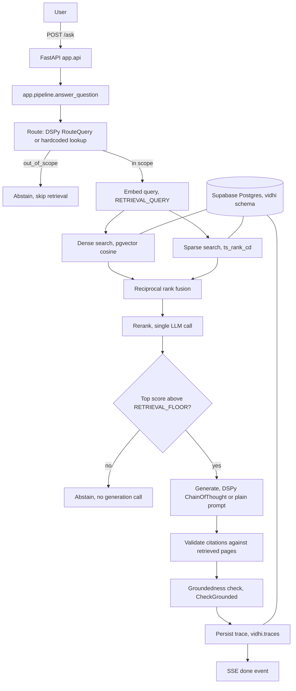

# Vidhi

**Ask questions about Bharat's GST Smart Guide (a 1500 page Indian tax reference
manual) and get answers with page citations, grounded in the actual text of the book.**

Try it live: **https://vidhi.readiq.app**

## What it does

Vidhi is a question answering assistant built on top of one large PDF. You ask a
question in plain English, and it searches the manual, finds the most relevant
passages, and writes an answer using only what it found, citing the exact page
numbers it used. If the manual does not cover your question, it says so instead of
guessing. Every question is answered independently, there is no chat history or
memory between questions.

This is not official tax advice. It is a demonstration of how to build a reliable,
grounded question answering system over a real document.

## Quick start

### Try it online

Open **https://vidhi.readiq.app** and ask a question. Use the dropdown near the top
to switch between four versions of the system (see "How well does it work" below) to
see the difference each improvement makes.

### Run it locally

```bash
docker build --build-arg GIT_SHA=$(git rev-parse --short HEAD) -t vidhi-local .
docker run --env-file .env -p 8080:8080 -e PORT=8080 vidhi-local
```

Then open `http://localhost:8080`. You will need your own Gemini API key and a
Postgres database with the `pgvector` extension (see `.env.example` and
`sql/schema.sql`).

---

## How it works



In plain terms: the question is first checked to see if it's even about GST at all.
If it is, the system searches the manual two different ways at once (by meaning, and
by keyword), combines the results, double checks which passages are actually most
relevant, and only then asks the language model to write an answer using just those
passages. Before and after generating an answer, the system checks itself: it refuses
to answer if nothing relevant enough was found, and afterward it checks whether the
answer's claims are actually backed by the retrieved text.

## How well does it work

The system ships in four configurations, so the effect of each improvement can be
measured on its own instead of taking one "it works well" claim on faith.

| Name | Retrieval | Answer generation |
|---|---|---|
| A_vanilla | Semantic search only, top 5 results | Plain prompt |
| B_hybrid | Semantic + keyword search combined, then reranked | Same plain prompt |
| C_dspy | Same as B | DSPy structured prompting, not yet tuned |
| D_optimized | Same as B | DSPy prompting, automatically tuned by MIPROv2 |

Measured on a 20 question subset of the evaluation set:

| Name | n | Recall@5 | Recall@10 | MRR@10 | Citation validity | Abstention accuracy | False abstention rate | Answer page overlap | Faithfulness | Answer relevancy | Context precision | Context recall |
|---|---|---|---|---|---|---|---|---|---|---|---|---|
| A_vanilla | 20 | 0.750 | 0.750 | 0.548 | 0.800 | 0.000 | 0.000 | 0.425 | 0.900 | 0.957 | 0.568 | n/a\* |
| B_hybrid | 20 | 0.800 | 0.800 | 0.631 | 0.737 | 0.000 | 0.050 | 0.421 | 0.935 | n/a\* | n/a\* | 1.000 |
| C_dspy | 20 | 0.750 | 0.750 | 0.573 | 1.000 | 0.000 | 0.100 | 0.528 | n/a\* | 0.952 | n/a\* | 1.000 |
| D_optimized | 20 | 0.750 | 0.750 | 0.675 | 1.000 | 0.000 | 0.100 | 0.528 | n/a\* | 0.978 | n/a\* | 1.000 |

\* n/a cells are metrics computed on a 5 question sample per config, small on purpose
because judged metrics are slower to compute; occasionally one metric lost all its
retries on one row at this small sample size, marked n/a rather than reported as 0.
Every config has at least two of these metrics with a real value.

Generated by `python -m eval.run_eval --configs A_vanilla,B_hybrid,C_dspy,D_optimized --split dev --n 20`.

**What these numbers mean in plain terms:** Recall@5 and Recall@10 measure whether the
correct page actually showed up among the top 5 or 10 search results. MRR measures how
close to the top of the results the correct page landed. Citation validity is how
often the pages the model claimed to cite were actually pages it had in front of it.
Faithfulness and answer relevancy are graded by a separate AI judge model, scoring
whether the answer is supported by the text and actually answers the question asked.

Switching from semantic-only search to combined semantic and keyword search (A to B)
improved the search quality itself. Switching to structured DSPy prompting (B to C)
made citations much more reliable. All four configs ran on the same 20 question
subset, not the full evaluation set, so read these numbers as directional evidence of
each change's effect rather than a final benchmark.

## Response time

Measured against a warm, already running instance, 5 requests per configuration,
averaged across all four configs:

| Metric | Warm | Cold (after scaling to zero) |
|---|---|---|
| Time to first token, p50 | 2901 ms | TBD |
| Time to first token, p95 | 3136 ms | TBD |
| Total response time, p50 | 4973 ms | TBD |
| Total response time, p95 | 11414 ms | TBD |
| Output speed | 3.33 tokens/sec | n/a |

Per-stage breakdown, warm only, averaged across all four configs:

| Stage | Mean ms | p95 ms |
|---|---|---|
| Query embedding | 743 | 909 |
| Retrieval (semantic and keyword search, run together) | 777 | 823 |
| Rerank | 1667 | 1988 |
| Answer generation | 925 | 1100 |
| Citation validation | 0.0 | 0.0 |
| Groundedness check | 2334 | 7214 |

**Why cold start exists.** This service scales down to zero instances when idle to
avoid running (and paying for) a server that nobody is using. The tradeoff is that the
very first request after a period of inactivity has to wait for a new instance to
start up before it can respond, that is the "cold" row above. Once warm, the service
responds quickly; that startup cost only happens once per idle period, not on every
request. Keeping one instance always running would remove the cold start entirely, at
a small ongoing hosting cost.

## The optimizer: did automatic prompt tuning help?

The `D_optimized` configuration uses **MIPROv2**, a DSPy optimizer that automatically
rewrites the answering instructions and searches for the best combination of
instruction wording and examples, judged by an automatic scoring function, rather than
a person hand tuning the prompt.

Why MIPROv2 specifically: it can rewrite the instruction text itself, not just choose
example answers to show the model. That matters here because the most important
behavior (saying "I don't know" instead of guessing) lives in how the instruction is
worded, not in which examples are attached. A simpler optimizer that only picks
examples would not be able to fix that kind of problem.

The scoring function used to judge each candidate prompt:

```
score = 0.6 x correctness (graded by an AI judge) + 0.4 x citation validity (pure arithmetic, no AI judge)
```

Mixing in a purely arithmetic component keeps the search from chasing noise in the AI
judge's grading.

**Honest result:** across 11 trials, the very first (unmodified) instruction scored
80.28 out of 100. The best trial the optimizer found also scored 80.28, a tie, with a
different wording. The optimizer correctly kept the original wording rather than
accepting a change that did not actually improve anything. In other words, in this
run, automatic tuning did not find a better prompt than the one written by hand. This
is a real, honestly reported result, not a shortcoming to hide: it means the
hand-written instruction was already close to as good as this search could find on
this dataset, and a larger training set or more search trials are the likely way to
find further improvement.

Score by trial:

| Trial | Score |
|---|---|
| 1 (original) | 80.28 |
| 2 | 0.00 |
| 3 | 80.07 |
| 4-6 | 0.00 |
| 7 | 80.07 |
| 8-10 | 0.00 |
| 11 | 80.28 |

(Trials scoring 0.00 failed during that trial's run rather than genuinely producing a
bad prompt.)

## Techniques used, briefly

- **Hybrid search with reciprocal rank fusion.** Semantic search (finds passages that
  mean the same thing) and keyword search (finds passages using the same words, good
  for exact rate figures and code numbers) are combined by a simple rank-based
  formula, so a good result from either method counts, without needing the two
  methods' scores to be on the same numeric scale.
- **LLM based reranking.** After the initial search, a single call to the language
  model re-orders the shortlist by relevance before anything is shown to the answering
  step.
- **DSPy for structured prompting.** Routing, answering, and grounding checks are
  written as typed input/output specifications rather than hand-written prompt
  strings, which is what lets an optimizer search over the wording automatically.
- **Guardrails before and after generation.** The system refuses to answer if nothing
  relevant enough was found (saving a wasted model call and preventing a made-up
  answer), and after generating, it checks whether every citation in the answer
  actually points at a page it retrieved, and whether the answer's claims are actually
  backed by the retrieved text.
- **Full request tracing.** Every stage of answering a question records its own
  timing, stored per request, which is what powers the response time numbers above
  and the `/trace/{request_id}` endpoint.

## Design choices worth knowing about

- **Reranking is one extra AI model call, not a separate specialized model.** A
  dedicated reranking model would need extra libraries that make the service slower to
  start up. Using the same model that also answers keeps the deployed service small
  and fast to start, at the cost of one extra model call per question.
  A dedicated reranking API would likely be faster and more accurate, and is a natural
  next upgrade.
- **Raw SQL instead of a database toolkit.** For a schema this small (two tables), raw
  SQL queries are easier to read and reason about than a database abstraction layer.
- **Scales to zero when idle.** Saves on hosting cost when nobody is using it, at the
  cost of the cold start described above. Worth changing if the traffic pattern
  justifies keeping an instance always warm.

## Known limitations and what's next

- **Evaluation numbers above are on a 20 question subset**, not the full evaluation
  set (which has 55 dev questions). The DSPy-based configurations make more model
  calls per question, so a full run takes meaningfully longer; widen the sample with
  more time.
- **The automatic quality-judging metrics ran on a 5 question sample**, smaller than
  ideal, for the same reason: those metrics are slower to compute since they involve
  their own extra AI judge calls per row.
- **Token counts are incomplete for the DSPy configurations.** The library used for
  DSPy's streaming does not reliably report how many tokens were sent in, only how
  many came back out, for those two configurations specifically.
- **Cold start has not yet been measured against the live deployment** and is marked
  `TBD` above; the code to measure it exists (`eval/metrics_latency.py`, `cold` mode)
  and can be run against the live URL.
- **No OCR pipeline.** 7 of 1321 pages (0.5 percent) in the source PDF appear to be
  scanned images rather than extractable text, and are not searchable by this system.
  Below the threshold where OCR would clearly be worth adding.
- **No load testing** beyond the concurrency setting configured on the hosting
  platform.
- **The automatic prompt tuning found no improvement in this run** (see above); a
  larger training set or more search trials are the likely next step to try.
